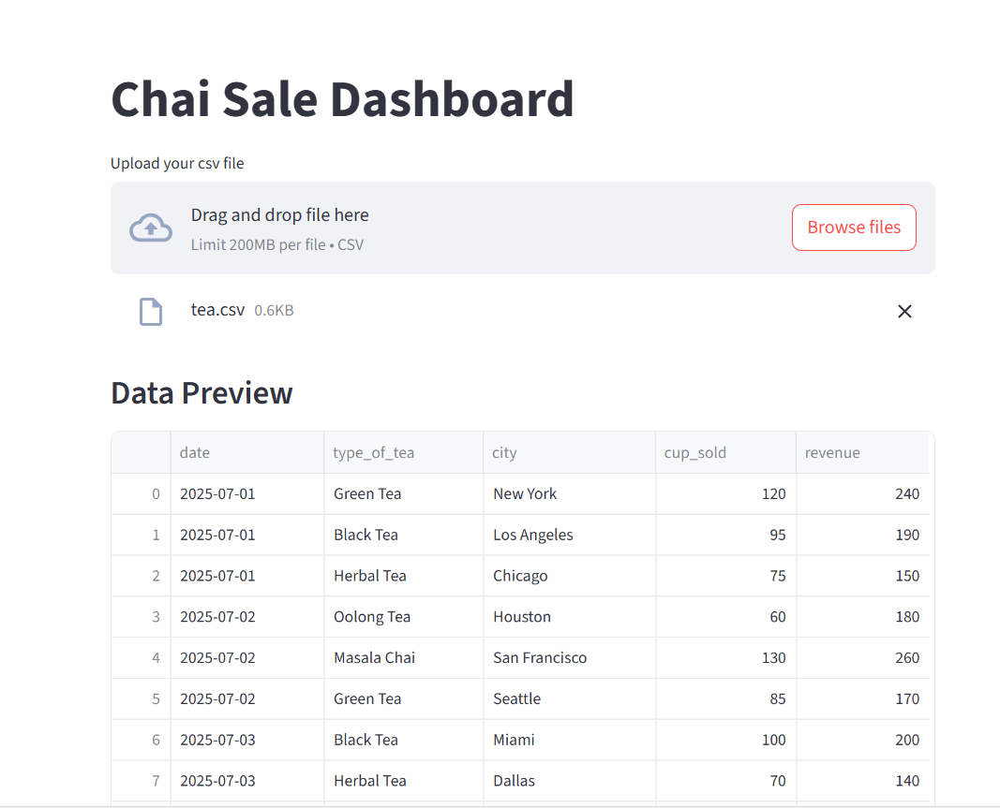
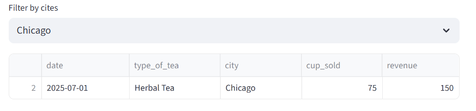

# Streamlit

A Faster wav to build and share data apps

- Purealy based on python

we are write code 2 types

1. inpretive code
2. declarative code:- eg yaml, tom

- declartiver not reqired html, css, js

## To Display messages

```py
import streamlit as st

st.title("Hello Chat App")
st.subheader("Brewed with streamlit")
st.text("Welcome to your first application")
st.write("choose your fav variety of chai")
```

### output


## Select box

```py
chai = st.selectbox("Your fav  chai: ", ["Masala chai", "Lemon Tea", "Adrak chai", "kesar Chai"])

st.write(f"Your choose {chai}. Excellent choise")
st.success("Your chai has been brewed!")
```

### output


## conditional

### if with success msg

```py
import streamlit as st

st.title("Cahi Maker App")

if st.button("Make Chai"):
    st.success("Your chai is being brewed")
```

Output:


### check box

```py
add_masala = st.checkbox("Add Masala")

if add_masala:
    st.write("Masala added to your chai")
```


### radio button

```py
tea_type = st.radio("Pick your chai base: ", ["Milk", "Water", "Almond Milk"])

st.write(f"Select base {tea_type}")
```


### select and slider

```py
flavour = st.selectbox("Choose flavour ", ["Adrak", "Kesar", "Tulsi"] )

sugar = st.slider("Sugar level", 0, 5, 2)
```

output


### numbers

```py
cups = st.number_input("How many cups", min_value=1, max_value=10, step=2)
st.write(f"Selected sugar level {cups}")
```


## input

```py
name = st.text_input("Plz ender your name")

if name:
    st.write(f"We {name}, Your chai is on the way")
```


```py
dob = st.date_input("Select your date of birth")
st.write(f"Your date of birth {dob}")
```


## plit the page

```py
import streamlit as st

col1, col2 = st.columns(2)

with col1:
    st.header("Masala Chai")
    
    vote1 = st.button("Vote Masala Chai")

with col2:
    st.header("Adrak Chai")
    vote2 = st.button("Vote Adrak Chai")

if vote1:
    st.success("Thanks for voting masala chai")

elif vote2:
    st.success("Thanks for voting Adrak Chai")
```


```py

with col2:
    st.header("Adrak Chai")
    st.image("https://images.pexels.com/photos/28052357/pexels-photo-28052357.jpeg", width=200)
    vote2 = st.button("Vote Adrak Chai")

```


### sidebar

```py
    

name = st.sidebar.text_input("Enter your name")
tea = st.sidebar.selectbox("Choose your chai", ["Masala", "kesae", "Adrak"])

st.write(f"Welcome {name} and your {tea} chai is getting ready")

```


### Expander

```py
with st.expander("show chai Making Instructions"):
    st.write(
        """
             1. Boil water with tea leaves
             2. Add milk and spices
             3. Serve hot
        """
    )
```


### makdow

```py
st.markdown("""
            ## test
            
            > new row
            """)
```

## file upload

```py
import streamlit as st
import pandas as pd

st.title("Chai Sale Dashboard")

file = st.file_uploader("Upload your csv file", type=['csv'])

if file:
    df = pd.read_csv(file)
    st.subheader("Data Preview")
    st.dataframe(df)

if file:
    st.subheader("Summary Stats")
    st.write(df.describe())
```




## filter data

```py
if file:
    cities = df["city"].unique()
    selected_city = st.selectbox("Filter  by cites", cities)
    
    
    filtered_data = df[df["city"] == selected_city]
    st.dataframe(filtered_data)

```


